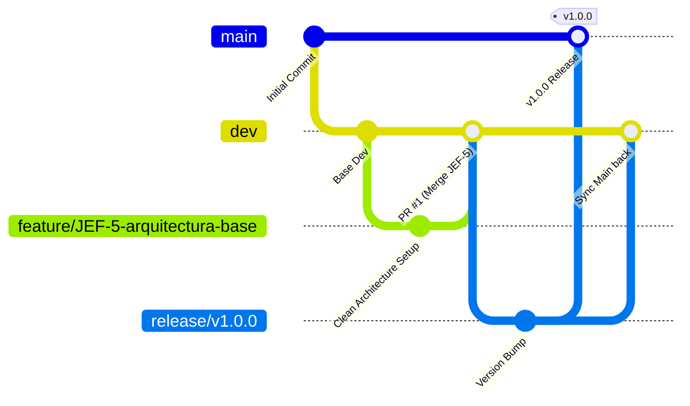

# 🧁 CostiBake (RecetarioApp)

> **Sistema Integral de Costeo Paramétrico, Recetario y Rentabilidad Comercial para Repostería**  
> Diseñado para operar en obradores y talleres de repostería con arquitectura **Offline-First**, alta precisión matemática y soporte transaccional ACID local.

---

## 📌 Visión General del Proyecto

En la pastelería artesanal y comercial, los errores en la conversión de unidades (volumen a peso), el desconocimiento del impacto de la merma, la omisión del costo de empaques descartables y la falta de imputación del valor del tiempo de mano de obra y costos indirectos (*overhead*) provocan márgenes de rentabilidad desvirtuados y fugas constantes de capital.

**CostiBake** resuelve esta asimetría operativa y financiera proveyendo:
1. **Normalización Automática a Granel:** Registro de compras comerciales (ej. bulto de 50 kg, galón de 3785 ml) y costeo al gramo o mililitro.
2. **Matriz de Densidades Culinarias:** Conversión estricta de medidas volumétricas culinarias (tazas, cdas, cdtas) a masa (gramos) según el ingrediente exacto (evitando la falacia de "1 taza = 250 g").
3. **Escalado Geométrico de Moldes:** Recálculo proporcional de cantidades y costos al cambiar de dimensiones o formatos de molde (redondo, rectangular, plancha).
4. **Motor de Costeo Integral Cuádruple:** Insumos prorrateados + Empaques directos + Alícuota de Mano de Obra + Porcentaje de Indirectos (*Overhead*).
5. **Fijación Dual de Precios y Markup:** Cálculo simultáneo del precio de venta sugerido y utilidad neta para el lote completo y por porción/rebanada individual con redondeo psicológico.
6. **Autonomía Offline-First Estricta:** 100% operativo en cocina sin requerir conexión a internet.

---

## 🛠️ Ecosistema y Recursos del Proyecto

* **Gestión de Proyecto (Linear):** [Tablero CostiBake (Key: JEF)](https://linear.app/jeffdevx/project/costibake-recetarioapp-05aa72d5c6ac)
* **Prototipo e Interfaz (Stitch):** *Artisanal Confectionery Financial OS* (Tokens de color caramelo/miel, tipografía Plus Jakarta Sans y componentes táctiles para cocina)
* **Especificación de Requerimientos (SRS):** [docs/CostiBake - SRS.docx](docs/CostiBake%20-%20SRS.docx)

---

## 🏛️ Arquitectura de Software

La aplicación está construida sobre **Flutter** siguiendo los principios de **Clean Architecture** (Separación estricta de responsabilidades):

```text
lib/
├── core/                  # Utilidades globales, constantes, extensiones y tema
│   ├── errors/            # Clases de fallos y excepciones tipadas
│   ├── theme/             # Design Tokens de Stitch (Colores, Tipografía Plus Jakarta Sans)
│   └── utils/             # Aritmética decimal exacta y utilidades culinarias
├── features/              # Módulos verticales orientados a características
│   ├── catalog/           # Catálogo de Insumos y Empaques (JEF-7, JEF-8, JEF-10)
│   │   ├── data/          # DAOs SQLite, modelos de datos, repositorios concretos
│   │   ├── domain/        # Entidades de negocio y casos de uso
│   │   └── presentation/  # Widgets, pantallas y controladores Riverpod
│   ├── recipes/           # Formulación, sub-recetas y escalado (JEF-13, JEF-14)
│   ├── costing/           # Motor financiero, overhead, markup y pricing (JEF-6, JEF-15, JEF-16)
│   └── settings/          # Parámetros del negocio y tabla de densidades (JEF-6, JEF-23)
└── main.dart              # Punto de entrada de la aplicación
```

### Principios No Negociables
- **Offline-First:** Persistencia relacional local en **SQLite** (vía **Drift**) con transacciones ACID.
- **Aritmética Financiera Exacta:** Prohibido el uso de flotantes binarios (`double`) en acumuladores de dinero. Se emplea aritmética decimal exacta (`package:decimal`).
- **Touch-First UI:** Objetivos de toque mínimos de 48x48 px, diseñados para manos activas en cocina.

---

## 🌿 Flujo de Trabajo GitFlow

El proyecto implementa la metodología estándar **GitFlow**:



### Ramas Permanentes
* **`main`**: Código en estado de producción estable. Protegida contra pushes directos.
* **`dev`**: Rama base de integración continua. Toda característica nueva converge aquí a través de Pull Requests.

### Convención de Ramas Temporales
* `feature/JEF-<ticket>-<descripcion-kebab-case>`
* `bugfix/JEF-<ticket>-<descripcion-kebab-case>`
* `release/v<version-semver>`
* `hotfix/v<version-semver>`

### Convención de Commits (Conventional Commits)
```text
feat(catalog): agregar normalización de insumos a granel (JEF-7)
fix(costing): corregir redondeo de alícuota de empaque en recetas (JEF-15)
test(conversion): agregar suite de pruebas para matriz de densidades (JEF-12)
refactor(theme): migrar tokens de color a Material 3 desde Stitch
docs(readme): actualizar guía de arquitectura y setup
```

---

## 🚀 Requisitos e Instalación

### Prerrequisitos
* Flutter SDK (>= 3.22.0)
* Dart SDK (>= 3.4.0)
* Android SDK (API 26+) / Xcode (15+)

### Primeros Pasos
```bash
# 1. Clonar el repositorio
git clone https://github.com/JeffDevX/costibake-app.git
cd costibake-app

# 2. Cambiar a la rama de desarrollo
git checkout dev

# 3. Obtener dependencias
flutter pub get

# 4. Ejecutar análisis estático y pruebas
flutter analyze
flutter test

# 5. Ejecutar la aplicación
flutter run
```

---

## 📄 Licencia y Propiedad
Proyecto privado desarrollado por **JeffDevX**. Todos los derechos reservados.
